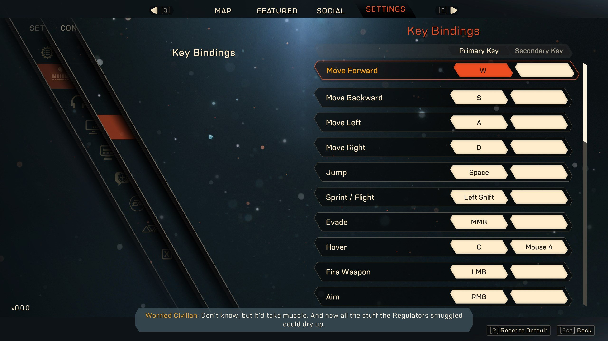
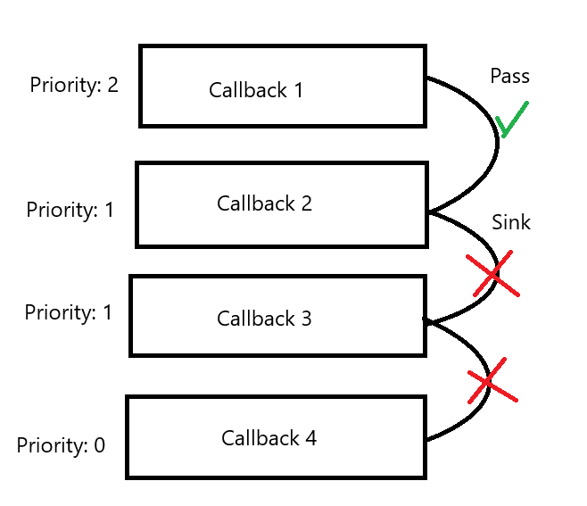

# ActionsController

## Activation

```ts
//init_actions.client.ts
InputActionsInitializerTools.InitActionsAndInputManager();

//or (not recommended)
ActionsController.Initialize();
InputManagerController.Initialize();
```

## Usage

let's create our first action

```ts
const action_name = "Crouch";
//create action
ActionsController.Add(action_name);

//add key code
ActionsController.AddKeyCode(action_name, Enum.KeyCode.LeftControl);

//not necessary, because 0.5 is default
//you able to change the ActiovationStrength
ActionsController.SetActivationStrength(action_name, 0.5);
```

definition

```ts
function Add(
	action_name: string,
	//the keycodes have the PressStrength 0 or 1, in cases like UserInputType
	//or some ECustomKey the value might vary
	activation_strength: number = 0.5,
	//can automatically connect the keys that will automatically activate the action
	key_codes: readonly InputKeyCode[] = [],
): void;
```

Now after we created Action not we're able to check it every frame

```ts
RunService.RenderStepped.Connect(() => {
	//checks if the action is pressed in this frame
	print(action_name, "Is pressed:", ActionsController.IsPressed(action_name));

	//check if the action was pressed in this frame but was released in the
	//previous frame therefore will be true only once if pressed
	print(action_name, "Is Just pressed", ActionsController.IsJustPressed(action_name));

	//Buffer

	//IsJustPressed - true
	//[Pressed, Released]

	//IsJustPressed - false
	//[Pressed, Pressed]

	//opposite of IsPressed
	print(action_name, "Is released:", ActionsController.IsReleased(action_name));
	//opposite of IsJustPressed
	print(action_name, "Is just released:", ActionsController.IsJustReleased(action_name));
	//recommended to use instead of !ActionsController.IsPressed() to increase readability
});
```

## Custom activation

By default InputManagerController handles the Action pressing

ActionsController allows to handle in customly on top
e.g for the phone ui

```ts
ToggleCrouchButton.Pressed.Connect(() => {
	if (ActionsController.IsPressed(action_name))
		//releases action
		ActionsController.Release(action_name);
	//presses the action
	else ActionsController.Press(action_name);
});
```

or you're able to set the press strength of action

```ts
//recommended to keep in between 0 - 1,
//where 0 - released
//1 - pressed
//but can be any value depending on usage case
const press_strength = 1;
ActionsController.Press(action_name, press_strength);
```

definition

```ts
function Press(action_name: string, strength: number = 1): void;
```

## Create bindings Map

Let's imagine that you're making a menu where the player could bind the key to an action


```ts
//to get all actions
const actions: string[] = ActionsController.GetActions();

//to get all InputKeyCodes bound to action
const keycodes_bound_to_action: readonly InputKeyCode[] =
	ActionsController.GetKeyCodes(action_name);

//check if key_code is bound to action
const key_code: InputKeyCode = Enum.KeyCode.W;
const has_keycode: boolean = ActionsController.HasKeyCode(action_name, key_code);

//check if the action exist
const is_action_existing: boolean = ActionsController.IsExisting(action_name);

//delete action
ActionsController.Erase(action_name);
```

### Handling adding and removing keys

The keys could be set

```ts
//add keycode
//the action can have as much keycodes as you need, you're not limited :)
ActionsController.AddKeyCode(action_name, Enum.KeyCode.LeftControl);

//removes keycode
ActionsController.EraseKeyCode(action_name, Enum.KeyCode.LeftControl);

//removes all keycodes from the action
ActionsController.EraseAllKeyCodes(action_name);
```

definition

```ts
function AddKeyCode(action_name: string, key_code: InputKeyCode): void;
```

# InputManager Controller

ActionController is used with combination with InputManagerController to create an input system

while the ActionController is used to check actions <b>every frame</b> or once the InputManagerController handles the all keys with <b>Input Event</b>

## Handling input with event

### Input Subscribtion

InputManagerController handles input like ContextActionService

every handler will be executed in sequence and each next can deside to prevent input to go further by returning `Enum.ContextActionResult`



```ts
const cleanup: () => void = InputManagerController.Subscribe(
	(input_event: InputEvent): Enum.ContextActionResult | void => {
		//prints the input event as text
		print(input_event.AsTest());

		//position from InputObject : Vector3
		print(input_event.Position);

		//Delta from InputObject : Vector3
		print(input_event.Delta);

		//: number
		print(input_event.PressStrength);

		//if input was caused by Enum.UserInputState.Change : boolean
		print(input_event.Changed);

		//: InputKeyCode
		print(input_event.InputKeyCode);

		//InputKeyCode already can be UserInputType but in some cases
		//UserInputType is required with KeyCode e.g UserInputType.Gamepad1
		//: Enum.UserInputType
		print(input_event.UserInputType);

		//Actions it's bound to : readonly string[]
		print(input_event.Actions);

		//whether the input_event is bound to action : boolean
		print(input_event.IsAction(action_name));

		//checks if the input_event contains action
		//if doesnt have action returns false
		//otherwise returns whether the action is pressed : boolean
		print(input_event.IsActionPressed(action_name));
		//opposite of input_event.IsActionPressed
		print(input_event.IsActionReleased(action_name));

		//checks if the input_event contains action
		//if doesnt have action returns false
		//otherwise returns same as ActionsController.IsJustPressed : boolean
		print(input_event.IsActionJustPressed(action_name));
		//opposite of input_event.IsActionJustPressed
		print(input_event.IsActionJustReleased(action_name));

		//optional @default 0.5
		const activation_strength = 0.5;
		//the actions have set ActivationStrength,
		//with this callback you can check if it's pressed with set activation_strength
		print(input_event.IsPressed(activation_strength));
		//opposite of IsPressed
		print(input_event.IsReleased());

		//: boolean
		print(input_event.IsKeyModifierPressed(Enum.ModifierKey.Alt));

		//to prevent from going further
		return Enum.ContextActionResult.Sink;

		//return nothing or ContextActionResult.Pass to allow input to go further
		return Enum.ContextActionResult.Pass;
	},
);
```

### I'm not subscribing to all keys?

Yes, the subsciption has limit in the config that prevents some sort of InputEvents to be passed in the callback

```ts
interface ISubscribtionConfig {
	Priority?: number;
	SubscriptionType?: EInputEventSubscribtionType;
}

const default_config: ISubscribtionConfig = {
	Priority: 1,
	//determines what kind of the InputEvents are you getting
	SubscriptionType: EInputEventSubscribtionType.KeysOnly,
};

//(included)
const enum EInputEventSubscribtionType {
	//all input
	All,
	//prevents InputEvents with ECustomKey
	AllWithNoCustomKeys,

	//prevents InputEvent with InputKeyCode that are cannot be pressed
	//a.k.a Changed = true
	KeysOnly,

	//allows only InputEvent where .Changed is true
	ChangedOnly,
	//allows only InputEvent where InputKeyCode is ECustomKey
	CustomKeysOnly,

	//combination of KeysOnly + CustomKeysOnly
	KeysWithCustomKeysOnly,
}

const cleanup = InputManagerController.Subscribe((input_event) => {
	print(input_event.AsText());
}, default_config);
```

### Custom InputEvent

As well as the ActionsController InputManager allows to emulate input via script

```ts
//activates only 1 action
const input_event_data = InputEventData.FromAction(action_name);

//optional
const user_input_type = Enum.UserInputType.None;
//emulates the key and activates all actions bound to it
const input_event_data = InputEventData.FromInputKeyCode(Enum.KeyCode.W, user_input_type);

//whether to mark input state as Enum.UserInputState.Change
input_event_data.Changed = false;
input_event_data.Position = Vector3.zero;
input_event_data.Delta = Vector3.zero;
input_event_data.PressStrength = 0.5;

//creates InputEvent and fires it to subscribed callbacks
InputManagerController.ParseInputEvent(input_event_data);
```
